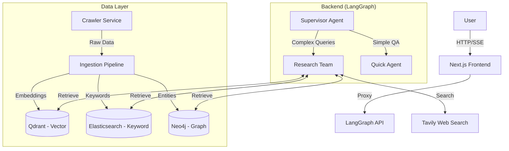

# NEFAC Chatbot - Agentic RAG System

## Overview

The **NEFAC Chatbot** is a comprehensive, full-stack AI assistant designed for the **New England First Amendment Coalition**. It leverages an **Agentic RAG (Retrieval-Augmented Generation)** architecture to index, analyze, and retrieve legal and educational content. The system combines a **LangGraph**-based backend with a streaming **Next.js** frontend and a robust **Hybrid RAG** ingestion pipeline (Vector + Keyword + Knowledge Graph).

**Core Purpose**: To provide accurate, cited, and deeply researched answers regarding First Amendment rights, public records laws, and open meeting regulations in New England.

## Architecture

The system follows a **Supervisor-Worker** agentic pattern, orchestrated by LangGraph and served via a Next.js application.



## Features

- **Deep Research Mode**: An iterative agent that plans, executes, and refines research strategies using web search and internal documents.
- **Hybrid RAG**: Combines semantic search (Qdrant), keyword search (Elasticsearch), and structural graph analysis (Neo4j) for high-recall retrieval.
- **Streaming UI**: Real-time visualization of the agent's thought process, tool calls, and generated artifacts.
- **Legal Knowledge Graph**: Automatically extracts and maps entities (Judges, Cases, Statutes) and their relationships.
- **"Zero Tolerance" Crawler**: A robust scraping engine for WordPress and YouTube that ensures data integrity.
- **Multi-Format Ingestion**: Supports PDF, HTML, YouTube transcripts, and Excel/CSV with structure preservation.

## Setup

### Prerequisites

Ensure you have the following installed:

- **Docker Desktop** (v24.0+)
- **Python 3.11+** (for backend development)
- **Node.js 18+** & **pnpm** (for frontend development)
- **Poetry** (Python dependency manager)

### Installation

1.  **Clone the Repository**

    ```bash
    git clone https://github.com/hungngodev/NEFAC-CHATBOT.git
    cd NEFAC-CHATBOT
    ```

2.  **Install Backend Dependencies**

    ```bash
    cd backend
    poetry install
    ```

3.  **Install Frontend Dependencies**
    ```bash
    cd client
    pnpm install
    ```

### Environment Variables

Create a `.env` file in the root directory. See `.env.template` for a full list.

| Variable            | Description                                                  | Required     |
| :------------------ | :----------------------------------------------------------- | :----------- |
| `OPENAI_API_KEY`    | API key for LLM (GPT-4o/GPT-5-nano) and Embeddings.          | Yes          |
| `TAVILY_API_KEY`    | API key for Tavily Web Search.                               | Yes          |
| `LANGSMITH_API_KEY` | API key for LangSmith tracing.                               | Recommended  |
| `POSTGRES_URI`      | Connection string for LangGraph state persistence.           | Yes (Docker) |
| `REDIS_URI`         | Connection string for Redis Cache.                           | Yes (Docker) |
| `NEO4J_URI`         | URL for Neo4j Graph Database.                                | Yes (Docker) |
| `NEO4J_USERNAME`    | Neo4j Username (default: neo4j).                             | Yes          |
| `NEO4J_PASSWORD`    | Neo4j Password.                                              | Yes          |
| `QDRANT_ENDPOINT`   | URL for Qdrant Vector Store (e.g., `http://localhost:6333`). | Yes (Docker) |
| `ES_HOST`           | URL for Elasticsearch (e.g., `http://localhost:9200`).       | Yes (Docker) |

## Running the Project

### Option A: Full Stack (Docker) - Recommended

Run the entire system (Frontend, Backend, Databases) in containers.

```bash
cd docker
docker-compose up -d --build
```

- **Frontend**: `http://localhost:3000`
- **Backend API**: `http://localhost:2024`
- **Neo4j Browser**: `http://localhost:7474`
- **Kibana**: `http://localhost:5601`

### Option B: Local Development

Run services individually for rapid iteration.

**1. Start Databases (Docker)**

```bash
cd docker
docker-compose up -d postgres redis qdrant elasticsearch neo4j
```

**2. Start Backend**

```bash
cd backend
poetry run langgraph dev
```

- Opens **LangGraph Studio** for interactive graph debugging.

**3. Start Frontend**

```bash
cd client
pnpm dev
```

- Access the UI at `http://localhost:3000`.

## Folder Structure

```text
NEFAC_CHATBOT/
├── backend/                # Python/LangGraph Backend
│   ├── src/
│   │   ├── app/            # API Server Entry Points
│   │   ├── core/           # Agent Logic (Supervisor, Research, Quick)
│   │   ├── service/        # Crawler & Ingestion Services
│   │   └── schemas/        # Pydantic Models & State Definitions
│   ├── pyproject.toml      # Python Dependencies
│   └── langgraph.json      # Graph Configuration
├── client/                 # Next.js Frontend
│   ├── src/
│   │   ├── app/            # App Router Pages & API Proxy
│   │   ├── components/     # React Components (Thread, Artifacts)
│   │   └── providers/      # Context Providers (Stream, Nuqs)
│   └── package.json        # Node Dependencies
├── docker/                 # Docker Compose & Configs
├── docs/                   # Detailed Documentation
└── README.md               # This file
```

## Core Components

### 1. Frontend (`client/`)

- **Framework**: Next.js 15 (App Router).
- **State**: URL-based state management (`nuqs`) for shareable contexts.
- **Streaming**: Server-Sent Events (SSE) via `@langchain/langgraph-sdk`.
- **Docs**: [Frontend Guide](docs/FRONTEND_GUIDE.md)

### 2. Backend (`backend/`)

- **Framework**: LangGraph.
- **Architecture**: Stateful graph with persistence (Postgres).
- **Agents**:
  - **Supervisor**: Routes queries.
  - **Research Team**: Performs deep, multi-step research.
  - **Quick Agent**: Handles simple, direct questions.
- **Docs**: [Backend Guide](docs/BACKEND_GUIDE.md)

### 3. Crawler (`backend/src/service/crawler/`)

- **Targets**: WordPress (REST API), YouTube (Transcripts).
- **Validation**: "Rigid Validator" ensures metadata/file sync.
- **Docs**: [Crawler Guide](docs/CRAWLER_GUIDE.md)

### 4. Ingestion (`backend/src/service/ingestion_service/`)

- **Pipeline**: LlamaIndex Workflow.
- **Process**: Load -> Parse -> Validate -> Index (Parallel).
- **Stores**: Qdrant (Vector), Elasticsearch (Keyword), Neo4j (Graph).
- **Docs**: [Ingestion Guide](docs/INGESTION_GUIDE.md)

## API Endpoints

The backend exposes a LangGraph-standard API.

- `POST /runs/stream`: Stream a new run.
- `POST /threads`: Create a new conversation thread.
- `GET /threads/{thread_id}/state`: Get current graph state.
- `POST /threads/{thread_id}/history`: Add messages to history.

The frontend proxies these via `/api/[...path]` to handle CORS and auth.

## Data Pipeline

1.  **Crawl**: Run the crawler to fetch data.
    ```bash
    python -m src.service.crawler.run --mode full
    ```
2.  **Ingest**: Process downloaded files into databases.
    ```bash
    python -m src.service.ingestion_service.processing --clear
    ```
3.  **Query**: The backend agents now have access to this data via `InternalDocumentSearch`.

## Deployment

See the [Deployment Guide](docs/DEPLOYMENT_GUIDE.md) for detailed production instructions.

- **Containerization**: All services are Dockerized.
- **Orchestration**: Docker Compose (local/staging) or Kubernetes (production).
- **Reverse Proxy**: Nginx handles routing and SSL.

## Contributing

1.  **Fork** the repository.
2.  **Create a Branch**: `git checkout -b feature/my-feature`.
3.  **Commit Changes**: `git commit -m "Add my feature"`.
4.  **Push to Branch**: `git push origin feature/my-feature`.
5.  **Open a Pull Request**.

Please ensure all new code includes type hints and follows the existing project structure.

## License

This project is licensed under the MIT License - see the [LICENSE](LICENSE) file for details.

## Architecture

The system follows a **Supervisor-Worker** agentic pattern, orchestrated by LangGraph and served via a Next.js application.


## Features

- **Deep Research Mode**: An iterative agent that plans, executes, and refines research strategies using web search and internal documents.
- **Hybrid RAG**: Combines semantic search (Qdrant), keyword search (Elasticsearch), and structural graph analysis (Neo4j) for high-recall retrieval.
- **Streaming UI**: Real-time visualization of the agent's thought process, tool calls, and generated artifacts.
- **Legal Knowledge Graph**: Automatically extracts and maps entities (Judges, Cases, Statutes) and their relationships.
- **"Zero Tolerance" Crawler**: A robust scraping engine for WordPress and YouTube that ensures data integrity.
- **Multi-Format Ingestion**: Supports PDF, HTML, YouTube transcripts, and Excel/CSV with structure preservation.

## Setup

### Prerequisites

Ensure you have the following installed:

- **Docker Desktop** (v24.0+)
- **Python 3.11+** (for backend development)
- **Node.js 18+** & **pnpm** (for frontend development)
- **Poetry** (Python dependency manager)

### Installation

1.  **Clone the Repository**

    ```bash
    git clone https://github.com/hungngodev/NEFAC-CHATBOT.git
    cd NEFAC-CHATBOT
    ```

2.  **Install Backend Dependencies**

    ```bash
    cd backend
    poetry install
    ```

3.  **Install Frontend Dependencies**
    ```bash
    cd client
    pnpm install
    ```

### Environment Variables

Create a `.env` file in the root directory. See `.env.template` for a full list.

| Variable            | Description                                                  | Required     |
| :------------------ | :----------------------------------------------------------- | :----------- |
| `OPENAI_API_KEY`    | API key for LLM (GPT-4o/GPT-5-nano) and Embeddings.          | Yes          |
| `TAVILY_API_KEY`    | API key for Tavily Web Search.                               | Yes          |
| `LANGSMITH_API_KEY` | API key for LangSmith tracing.                               | Recommended  |
| `POSTGRES_URI`      | Connection string for LangGraph state persistence.           | Yes (Docker) |
| `REDIS_URI`         | Connection string for Redis Cache.                           | Yes (Docker) |
| `NEO4J_URI`         | URL for Neo4j Graph Database.                                | Yes (Docker) |
| `NEO4J_USERNAME`    | Neo4j Username (default: neo4j).                             | Yes          |
| `NEO4J_PASSWORD`    | Neo4j Password.                                              | Yes          |
| `QDRANT_ENDPOINT`   | URL for Qdrant Vector Store (e.g., `http://localhost:6333`). | Yes (Docker) |
| `ES_HOST`           | URL for Elasticsearch (e.g., `http://localhost:9200`).       | Yes (Docker) |

## Running the Project

### Option A: Full Stack (Docker) - Recommended

Run the entire system (Frontend, Backend, Databases) in containers.

```bash
cd docker
docker-compose up -d --build
```

- **Frontend**: `http://localhost:3000`
- **Backend API**: `http://localhost:2024`
- **Neo4j Browser**: `http://localhost:7474`
- **Kibana**: `http://localhost:5601`

### Option B: Local Development

Run services individually for rapid iteration.

**1. Start Databases (Docker)**

```bash
cd docker
docker-compose up -d postgres redis qdrant elasticsearch neo4j
```

**2. Start Backend**

```bash
cd backend
poetry run langgraph dev
```

- Opens **LangGraph Studio** for interactive graph debugging.

**3. Start Frontend**

```bash
cd client
pnpm dev
```

- Access the UI at `http://localhost:3000`.

## Folder Structure

```text
NEFAC_CHATBOT/
├── backend/                # Python/LangGraph Backend
│   ├── src/
│   │   ├── app/            # API Server Entry Points
│   │   ├── core/           # Agent Logic (Supervisor, Research, Quick)
│   │   ├── service/        # Crawler & Ingestion Services
│   │   └── schemas/        # Pydantic Models & State Definitions
│   ├── pyproject.toml      # Python Dependencies
│   └── langgraph.json      # Graph Configuration
├── client/                 # Next.js Frontend
│   ├── src/
│   │   ├── app/            # App Router Pages & API Proxy
│   │   ├── components/     # React Components (Thread, Artifacts)
│   │   └── providers/      # Context Providers (Stream, Nuqs)
│   └── package.json        # Node Dependencies
├── docker/                 # Docker Compose & Configs
├── docs/                   # Detailed Documentation
└── README.md               # This file
```

## Core Components

### 1. Frontend (`client/`)

- **Framework**: Next.js 15 (App Router).
- **State**: URL-based state management (`nuqs`) for shareable contexts.
- **Streaming**: Server-Sent Events (SSE) via `@langchain/langgraph-sdk`.
- **Docs**: [Frontend Guide](docs/FRONTEND_GUIDE.md)

### 2. Backend (`backend/`)

- **Framework**: LangGraph.
- **Architecture**: Stateful graph with persistence (Postgres).
- **Agents**:
  - **Supervisor**: Routes queries.
  - **Research Team**: Performs deep, multi-step research.
  - **Quick Agent**: Handles simple, direct questions.
- **Docs**: [Backend Guide](docs/BACKEND_GUIDE.md)

### 3. Crawler (`backend/src/service/crawler/`)

- **Targets**: WordPress (REST API), YouTube (Transcripts).
- **Validation**: "Rigid Validator" ensures metadata/file sync.
- **Docs**: [Crawler Guide](docs/CRAWLER_GUIDE.md)

### 4. Ingestion (`backend/src/service/ingestion_service/`)

- **Pipeline**: LlamaIndex Workflow.
- **Process**: Load -> Parse -> Validate -> Index (Parallel).
- **Stores**: Qdrant (Vector), Elasticsearch (Keyword), Neo4j (Graph).
- **Docs**: [Ingestion Guide](docs/INGESTION_GUIDE.md)

## API Endpoints

The backend exposes a LangGraph-standard API.

- `POST /runs/stream`: Stream a new run.
- `POST /threads`: Create a new conversation thread.
- `GET /threads/{thread_id}/state`: Get current graph state.
- `POST /threads/{thread_id}/history`: Add messages to history.

The frontend proxies these via `/api/[...path]` to handle CORS and auth.

## Data Pipeline

1.  **Crawl**: Run the crawler to fetch data.
    ```bash
    python -m src.service.crawler.run --mode full
    ```
2.  **Ingest**: Process downloaded files into databases.
    ```bash
    python -m src.service.ingestion_service.processing --clear
    ```
3.  **Query**: The backend agents now have access to this data via `InternalDocumentSearch`.

## Deployment

See the [Deployment Guide](docs/DEPLOYMENT_GUIDE.md) for detailed production instructions.

- **Containerization**: All services are Dockerized.
- **Orchestration**: Docker Compose (local/staging) or Kubernetes (production).
- **Reverse Proxy**: Nginx handles routing and SSL.

## Contributing

1.  **Fork** the repository.
2.  **Create a Branch**: `git checkout -b feature/my-feature`.
3.  **Commit Changes**: `git commit -m "Add my feature"`.
4.  **Push to Branch**: `git push origin feature/my-feature`.
5.  **Open a Pull Request**.

Please ensure all new code includes type hints and follows the existing project structure.

## License

This project is licensed under the MIT License - see the [LICENSE](LICENSE) file for details.
