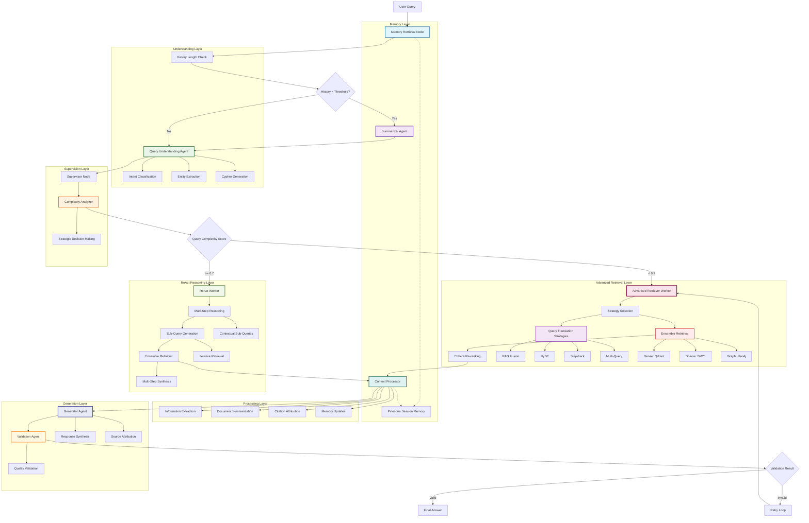

# Current Agent Flow Diagram - Enhanced Hierarchical Multi-Agent System

This document outlines the current architecture of the enhanced multi-agent system as of January 2025. The system now implements a sophisticated hierarchical architecture with memory management, automatic summarization, and intelligent routing based on query complexity.

## System Overview

The system follows a **hierarchical multi-agent architecture** with the following key features:
- **Memory-aware processing** with Pinecone session storage
- **Automatic chat history summarization** when thresholds are exceeded
- **Intelligent routing** based on query complexity analysis
- **Type-safe agent communication** with unified state management
- **Multi-step reasoning** for complex queries
- **Comprehensive validation** and error handling

## Enhanced Agent Flow



## Detailed Flow Breakdown

### 1. Memory Layer
- **Memory Retrieval Node**: Retrieves relevant past interactions using MemoryManager
- **History Length Check**: Determines if chat history needs summarization (threshold: 10 messages)
- **Summarizer Agent**: Automatically summarizes long conversations to maintain context window efficiency
- **Session Memory Store**: Pinecone-based persistent memory with semantic search capabilities

### 2. Understanding Layer
- **Query Understanding Agent**: Enhanced with intent classification and entity extraction
- **Intent Classification**: Categorizes queries (document request, graph query, general question)
- **Entity Extraction**: Identifies key entities for targeted retrieval

### 3. Supervision Layer
- **Supervisor Node**: Central orchestration with intelligent routing decisions
- **Complexity Analyzer**: Analyzes query complexity using multiple factors:
  - Query length and structure
  - Required reasoning steps
  - Domain complexity
  - Historical context needs
- **Strategic Decision Making**: Routes to appropriate workers based on complexity score

### 4. Execution Layer
- **Advanced Retriever Worker**: True ensemble retrieval with three-method coordination
  - **LangChain EnsembleRetriever**: Weighted combination of Dense + Sparse + Graph
  - **Method 1 - Dense (Qdrant)**: Semantic similarity with text-embedding-3-large
  - **Method 2 - Sparse (BM25)**: Exact term matching for legal terminology
  - **Method 3 - Graph (Neo4j)**: Entity relationships with 522-line implementation
  - **8 Query Translation Techniques**: RAG Fusion, HyDE, Step-back, Multi-Query, etc.
  - **Multi-Query Processing**: Expanded queries across all three methods
  - **Cohere Re-ranking**: Advanced relevance optimization post-ensemble
  - **Intelligent Deduplication**: Content and metadata-based across all methods
- **ReAct Worker**: Complex multi-step reasoning with advanced query processing
  - Sub-question generation with contextual awareness
  - Iterative information gathering with ensemble retrieval
  - Multi-step synthesis with memory integration

### 5. Processing Layer
- **Context Processor**: Enhanced with memory integration
  - Information extraction from documents
  - Document summarization for large contexts
  - Citation and source attribution
  - Session memory updates (Pinecone)

### 6. Generation Layer
- **Generator Agent**: Synthesizes final responses with memory awareness
- **Validation Agent**: Comprehensive quality checks:
  - Factual accuracy against sources
  - Completeness of answer
  - Relevance to original query
  - Citation verification

## Key Architectural Features

### Memory Management
- **Session-based isolation**: Each user session maintains separate memory
- **Automatic summarization**: Prevents context window overflow
- **Semantic memory retrieval**: Relevant past interactions inform current responses
- **Memory persistence**: Long-term storage with Pinecone vector database

### Intelligent Routing
- **Complexity-based decisions**: Simple queries -> fast retrieval, complex queries -> reasoning
- **Adaptive thresholds**: Complexity scoring considers multiple factors
- **Fallback mechanisms**: Error handling with graceful degradation

### Type Safety & Reliability
- **Unified AgentState**: Single state object flows through all nodes
- **Pydantic validation**: Type-safe data structures throughout
- **Error propagation**: Comprehensive error handling and recovery
- **Retry mechanisms**: Automatic retry for failed operations

### Performance Optimization
- **Lazy agent initialization**: Agents created only when needed
- **Parallel processing**: Independent operations run concurrently
- **Caching strategies**: LLM responses and embeddings cached appropriately
- **Memory efficiency**: Automatic cleanup and summarization

## Agent Interaction Patterns

### 1. Hierarchical Delegation
```
Supervisor -> Worker -> Tools -> Generator -> Validator
```

### 2. Memory Integration
```
Query -> Memory Retrieval -> Processing -> Memory Update
```

### 3. Validation Loop
```
Generation -> Validation -> [Retry if needed] -> Final Answer
```

## State Management

The system uses a unified `AgentState` that includes:
- **Core conversation**: Messages, user query, session info
- **Routing decisions**: Supervisor choices, complexity scores
- **Memory context**: Retrieved memories, summaries
- **Processing results**: Documents, extractions, citations
- **Generation outputs**: Answers, validation results
- **Error handling**: Error messages, retry counts

## Complexity Analysis Criteria

The Complexity Analyzer evaluates queries based on:

1. **Structural Complexity**
   - Query length and linguistic complexity
   - Number of sub-questions or components
   - Presence of conditional logic

2. **Reasoning Requirements**
   - Need for multi-step inference
   - Requirement for synthesis across sources
   - Temporal or causal reasoning needs

3. **Domain Specificity**
   - Technical terminology density
   - Domain expertise requirements
   - Cross-domain knowledge integration

4. **Context Dependencies**
   - Reliance on conversation history
   - Need for external knowledge
   - Ambiguity resolution requirements

## Performance Metrics

### Response Quality
- **Accuracy**: Factual correctness against source documents
- **Completeness**: Coverage of all query aspects
- **Relevance**: Alignment with user intent
- **Coherence**: Logical flow and readability

### System Performance
- **Response Time**: End-to-end query processing time
- **Memory Efficiency**: Context window utilization
- **Cache Hit Rate**: Effectiveness of caching strategies
- **Error Rate**: Frequency of processing failures

## Error Handling Strategy

### Graceful Degradation
1. **Primary Path Failure**: Route to alternative worker
2. **Memory Retrieval Issues**: Continue with current context only
3. **Validation Failures**: Retry with refined approach
4. **Complete System Failure**: Return helpful error message

### Recovery Mechanisms
- **Automatic Retry**: Up to 3 attempts with exponential backoff
- **Fallback Routing**: Alternative paths for failed operations
- **State Preservation**: Maintain context across retry attempts
- **User Notification**: Clear communication of limitations

## Future Enhancements

### Planned Improvements
1. **Advanced Memory Clustering**: Semantic grouping of related memories
2. **Predictive Pre-loading**: Anticipate user needs based on context
3. **Domain-Specific Agents**: Specialized agents for different knowledge domains
4. **Adaptive Learning**: System learns from user feedback and interactions
5. **Performance Monitoring**: Real-time metrics and optimization

### Scalability Considerations
- **Horizontal scaling**: Multiple worker instances for high load
- **Memory partitioning**: Efficient memory distribution across instances
- **Caching layers**: Redis for frequently accessed data
- **Load balancing**: Intelligent request distribution

## Integration Points

### External Services
- **Pinecone**: Vector database for session memory
- **OpenAI**: LLM services for generation and analysis
- **Knowledge Graph**: Structured data retrieval
- **Document Store**: Vector and keyword search capabilities

### API Interfaces
- **REST API**: Standard HTTP endpoints for queries
- **WebSocket**: Real-time streaming responses
- **GraphQL**: Flexible query interface for complex requests
- **Webhook**: Event-driven integrations

## Conclusion

The enhanced hierarchical multi-agent system provides:
- **Intelligent routing** based on query complexity
- **Long-term memory** with automatic management
- **Type-safe operations** with comprehensive error handling
- **Scalable architecture** ready for production deployment
- **Extensible design** for future enhancements

This architecture represents a significant advancement from the previous pipeline-based approach, offering more sophisticated reasoning capabilities while maintaining reliability and performance. The system successfully balances complexity with usability, providing powerful AI capabilities while ensuring consistent and reliable operation.