# Current Agent Flow - NEFAC Chatbot Backend (Enhanced Implementation Analysis)

## System Overview

The NEFAC chatbot implements a **Hierarchical Multi-Agent System** using LangGraph for orchestration. The system processes legal queries through a sophisticated pipeline with intelligent routing, memory management, and advanced retrieval capabilities. This document provides a detailed analysis of every component, agent, tool, and data flow in the current implementation.

## Architecture Summary

**Framework**: LangGraph with StateGraph orchestration  
**State Management**: Enhanced AgentState with structured typing  
**Agent Pattern**: Supervisor-Worker with specialized agents  
**Memory**: Qdrant-based semantic memory with user isolation  
**Retrieval**: Multi-modal ensemble (Dense Vector + Sparse BM25 + Graph Neo4j)  
**Error Handling**: Comprehensive with structured error types  
**Streaming**: Full streaming support with real-time responses  
**Enhanced Features**: Runnable interfaces, Query translation strategies, EnsembleRetrieverTool

## Enhanced Agent Flow Diagram

```mermaid
graph TD
    A[User Query] --> B[Memory Retrieval Node]
    B --> C[History Length Check]
    C --> D[Query Understanding Node]
    D --> E[Supervisor Node]
    E --> F{Complexity Analysis}
    F -->|< 0.3 Simple| G[Retriever Worker]
    F -->|0.3-0.7 Medium| G[Retriever Worker] 
    F -->|> 0.7 Complex| H[ReAct Worker]
    G --> I[Context Processor]
    H --> I
    I --> J[Generator Node]
    J --> K[Validation Node]
    K -->|Valid| L[Final Answer]
    K -->|Invalid| G
    K -->|Error| M[Error Handler]
    
    subgraph "Memory Layer - MemoryManager"
        B --> B1[retrieve_memories]
        B1 --> B2[Qdrant Semantic Search]
        B2 --> B3[User Isolation Filter]
        B3 --> B4[SessionMemoryEntry Objects]
        B4 --> B5[Memory Summary Creation]
    end
    
    subgraph "Understanding Layer - QueryUnderstandingAgent"
        D --> D1[understand_query]
        D1 --> D2[Contextualization Chain]
        D2 --> D3[Entity Extraction Chain]
        D3 --> D4[Intent Classification]
        D4 --> D5[Cypher Query Generation]
        D5 --> D6[Statistical Query Generation]
    end
    
    subgraph "Supervision Layer - ComplexityAnalyzer"
        E --> E1[analyze_complexity]
        E1 --> E2[Multi-dimensional Analysis]
        E2 --> E3[Linguistic Complexity]
        E2 --> E4[Domain Complexity]
        E2 --> E5[Reasoning Complexity]
        E2 --> E6[Temporal Complexity]
        E3 --> E7[Routing Decision]
        E4 --> E7
        E5 --> E7
        E6 --> E7
    end
    
    subgraph "Retrieval Layer - EnsembleRetrieverTool"
        G --> G1[Strategy Selection]
        G1 --> G2[LLM-based Selection]
        G1 --> G3[Rule-based Fallback]
        G2 --> G4[Create Ensemble Retriever]
        G3 --> G4
        G4 --> G5[Vector Retrieval - Qdrant]
        G4 --> G6[Keyword Retrieval - BM25]
        G4 --> G7[Graph Retrieval - Neo4j]
        G5 --> G8[Document Fusion]
        G6 --> G8
        G7 --> G8
        G8 --> G9[Deduplication]
        G9 --> G10[Reranking - CohereRerank]
        G10 --> G11[Final Documents]
    end
    
    subgraph "ReAct Layer - Multi-Step Reasoning"
        H --> H1[Sub-question Generation]
        H1 --> H2[Query Translation Strategy]
        H2 --> H3[Multi-Query Strategy]
        H2 --> H4[Decomposition Strategy]
        H2 --> H5[Step-Back Strategy]
        H2 --> H6[HyDE Strategy]
        H2 --> H7[RAG Fusion Strategy]
        H3 --> H8[EnsembleRetrieverTool]
        H4 --> H8
        H5 --> H8
        H6 --> H8
        H7 --> H8
        H8 --> H9[Context Synthesis]
        H9 --> H10[Final Synthesis]
    end
    
    subgraph "Context Processing Pipeline"
        I --> I1[Information Extraction Tool]
        I --> I2[Citation Attribution Tool]
        I --> I3[Context Summarization Tool]
        I --> I4[Memory Integration]
        I1 --> I5[ExtractedInformation Objects]
        I2 --> I6[DocumentCitation Objects]
        I3 --> I7[Summarized Documents]
        I4 --> I8[SessionMemoryEntry Integration]
        I5 --> I9[Processed Context]
        I6 --> I9
        I7 --> I9
        I8 --> I9
    end
    
    subgraph "Generation Layer - GeneratorAgent"
        J --> J1[Intent-based Routing]
        J1 --> J2[GENERAL_PROMPT]
        J1 --> J3[FINAL_PROMPT]
        J2 --> J4[Response Generation]
        J3 --> J4
        J4 --> J5[Confidence Scoring]
        J5 --> J6[Generated Answer]
    end
    
    subgraph "Validation Layer - ValidationAgent"
        K --> K1[Validation Chain]
        K1 --> K2[Context Alignment Check]
        K1 --> K3[Completeness Check]
        K1 --> K4[Accuracy Check]
        K2 --> K5[Validation Result]
        K3 --> K5
        K4 --> K5
        K5 --> K6[Routing Decision]
    end
```



## Enhanced Runnable Architecture

The system implements **LangChain Runnable interfaces** for better composability and integration:

### Runnable Agent Implementations

#### **RunnableComplexityAnalyzer**
- **File**: `src/core/agents/enhanced_runnable_agents.py`
- **Interface**: `Runnable[Dict[str, str], Dict[str, str]]`
- **Purpose**: Complexity analysis with Runnable interface
- **Chain Composition**: Can be piped with other Runnables using `|` operator

#### **RunnableContextualizer**
- **Interface**: `Runnable[Dict[str, str], Dict[str, str]]`
- **Purpose**: Query understanding as Runnable
- **Features**: Contextualization, entity extraction, intent classification

#### **RunnableRetriever**
- **Interface**: `Runnable[str, List[Document]]`
- **Purpose**: Retrieval with BaseRetriever compatibility
- **Integration**: Works with LangChain retrieval chains

#### **RunnableGenerator**
- **Interface**: `Runnable[Dict[str, str], str]`
- **Purpose**: Response generation as Runnable
- **Features**: Intent-based routing, confidence scoring

### Chain Composition Example
```python
# Create complete agent processing chain using Runnable composition
chain = (
    complexity_analyzer.as_runnable() | 
    contextualizer.as_runnable() | 
    generator.as_runnable()
)
```

## EnsembleRetrieverTool Architecture (Enhanced)

### Universal Retrieval Interface

The `EnsembleRetrieverTool` serves as a **universal retrieval interface** that can be used by:
- Query translation strategies (RAG Fusion, HyDE, Step-back, etc.)
- ReAct multi-step reasoning agent
- Any other component needing retrieval

#### **Dual Interface Design**
```python
class EnsembleRetrieverTool(BaseRetriever):
    # LangChain BaseRetriever interface
    def _get_relevant_documents(self, query: str) -> List[Document]
    def invoke(self, query: str) -> List[Document]
    
    # Standalone tool interface
    def retrieve(self, query: str, methods: List[str], weights: List[float]) -> List[Document]
    def retrieve_for_react_agent(self, state: AgentState) -> ReactAgentRetrievalOutput
```

#### **Intelligent Strategy Selection**

##### **LLM-based Strategy Selection**
- **Prompt Engineering**: Multi-dimensional analysis prompts
- **Query Characteristics**: Analyzes conceptual vs factual nature
- **Method Selection**: Chooses optimal combination of dense/sparse/graph
- **Weight Distribution**: Intelligent weighting based on query type

##### **Rule-based Fallback**
- **Entity Patterns**: Detects entity-relationship queries
- **Exact Term Patterns**: Identifies specific legal terms, citations
- **Concept Patterns**: Recognizes conceptual/explanatory queries
- **Question Analysis**: Analyzes question words and structure

#### **Advanced Features**

##### **Query Expansion**
- **Graph-based Expansion**: Uses Neo4j relationships for query enhancement
- **Entity Relationships**: Expands queries using entity connections
- **Conditional Application**: Only when beneficial for retrieval

##### **Document Processing Pipeline**
1. **Parallel Retrieval**: All methods execute in parallel
2. **Deduplication**: Content-based deduplication with metadata preservation
3. **Reranking**: CohereRerank for improved relevance
4. **Metadata Enhancement**: Adds retrieval strategy information

##### **Factory Functions**
```python
# General purpose ensemble retriever
get_ensemble_retriever(llm=None, methods=None, weights=None)

# Optimized for query translation strategies
get_ensemble_retriever_for_query_translation(llm=None)  # [0.4, 0.3, 0.3]

# Optimized for ReAct multi-step reasoning
get_ensemble_retriever_for_react(llm=None)  # [0.3, 0.2, 0.5] - Favor graph
```

## Query Translation Strategies (Detailed)

### Strategy Ecosystem

The system implements **7 sophisticated query translation strategies** that work with the `EnsembleRetrieverTool`:

#### **1. Multi-Query Strategy** (`multi_query.py`)
- **Purpose**: Generate multiple perspectives of the same query
- **Prompt**: `MULTI_QUERY_PERSPECTIVES_PROMPT`
- **Process**:
  1. Generate query variations using LLM
  2. Retrieve for each variation using ensemble retriever
  3. Apply `get_unique_union()` for intelligent deduplication
  4. Format combined results
- **Ensemble Config**: `[0.5, 0.25, 0.25]` - Favor semantic for diversity

#### **2. Decomposition Strategy** (`decomposition.py`)
- **Purpose**: Break complex queries into sub-questions
- **Prompt**: `DECOMPOSITION_PROMPT`
- **Process**:
  1. Generate sub-questions using structured decomposition
  2. Retrieve context for each sub-question
  3. Answer sub-questions iteratively with Q&A chain
  4. Synthesize final answer from accumulated Q&A pairs
- **Ensemble Config**: `[0.4, 0.3, 0.3]` - Balanced for comprehensive coverage

#### **3. Step-Back Strategy** (`step_back.py`)
- **Purpose**: Generate abstract, high-level questions
- **Examples**: Legal context examples for few-shot learning
- **Process**:
  1. Generate step-back question for broader context
  2. Dual retrieval (original + step-back questions)
  3. Combine contexts for comprehensive understanding
- **Use Case**: Complex legal concepts requiring foundational knowledge

#### **4. HyDE Strategy** (`hyDe.py`)
- **Purpose**: Generate hypothetical document content
- **Process**: 
  1. Create ideal answer to the question
  2. Use hypothetical answer for retrieval
  3. Find documents similar to ideal answer
- **Advantage**: Bridges semantic gap between questions and answers

#### **5. RAG Fusion Strategy** (`rag_fusion.py`)
- **Purpose**: Fusion of multiple retrieval approaches
- **Process**: 
  1. Generate multiple query reformulations
  2. Retrieve using different strategies
  3. Apply reciprocal rank fusion for result combination
- **Advanced**: Combines benefits of multiple approaches

#### **6. Factual Strategy** (`factual_strategy.py`)
- **Purpose**: Fact-focused retrieval for specific information
- **Optimization**: Emphasizes exact matches and specific details
- **Use Case**: Legal citations, specific regulations, dates

#### **7. Contextual Strategy** (`contextual_strategy.py`)
- **Purpose**: Context-aware processing with conversation history
- **Features**: Incorporates chat history and session context
- **Use Case**: Follow-up questions, clarifications

### Strategy Selection and Application

#### **Query Transformer Agent**
```python
def query_transformer_agent(state: AgentState) -> Dict[str, Union[str, int, float, bool, None]]:
    method = state.retrieval_method or "multiquery"
    
    # Strategy selection with ensemble retriever integration
    if "multiquery" in method:
        transformer_chain = get_multi_query_chain()  # Uses ensemble internally
    elif "decompose" in method:
        transformer_chain = get_decomposition_chain()  # Uses ensemble internally
    # ... other strategies
    
    transformed_result = transformer_chain.invoke({"question": state.contextualized_query})
    return {"transformed_query": transformed_result}
```

## Context Processing Pipeline (Enhanced)

### Processing Architecture

The **Context Processor** implements a sophisticated pipeline for document processing and augmentation:

#### **Sequential Processing Steps**

##### **1. Information Extraction Tool**
- **Input**: Retrieved documents from ensemble retriever
- **Process**:
  1. Document metadata extraction and validation
  2. Content snippet creation (200 character summaries)
  3. Structured `ExtractedInformation` object creation
  4. Memory storage via `add_memory_to_pinecone()`
- **Output**: List of `ExtractedInformation` objects with structured metadata

##### **2. Citation Attribution Tool**
- **Process**:
  1. Source URL and title extraction from document metadata
  2. Page number and document ID mapping
  3. Structured `DocumentCitation` object creation with relevance scoring
  4. Citation formatting for legal compliance
- **Output**: List of `DocumentCitation` objects for answer attribution

##### **3. Context Summarization Tool**
- **Trigger**: Documents exceeding 500 characters
- **Chain**: `summarization_prompt | llm | StrOutputParser()`
- **Process**: 
  1. LLM-based summarization preserving key legal details
  2. Metadata preservation during summarization
  3. Length optimization for context windows
- **Output**: Summarized Document objects with preserved citations

##### **4. Memory Integration**
- **Source**: Pinecone vector store with session isolation
- **Process**:
  1. Retrieve top-k relevant session memories
  2. Convert raw memory to `SessionMemoryEntry` objects
  3. Integrate with current processing context
  4. Relevance scoring and ranking
- **Output**: Integrated session memory for personalized responses

#### **Context Processor Output**
```python
{
    "documents": processed_documents,
    "extracted_info": structured_information_objects,
    "summarized_content": summarized_documents,
    "citations": document_citations,
    "session_memory": session_memory_entries
}
```

## Enhanced State Management and Typing

### State Type Hierarchy

#### **Core State Types**
1. **AgentState** (`core_types.py`): Main state for agent operations
2. **GraphState** (`langgraph_types.py`): LangGraph-specific state with TypedDict
3. **Enhanced Context Types** (`enhanced_context_types.py`): Extended context handling

#### **Protocol-Based Architecture**
```python
# Agent protocols for strong typing
class ComplexityAnalyzerProtocol(Protocol):
    def analyze_complexity(self, query: str, chat_history: List[BaseMessage]) -> ComplexityResult

class RetrieverProtocol(Protocol):
    def retrieve_documents(self, state: AgentState) -> RetrievalResult

class GeneratorProtocol(Protocol):
    def generate_answer(self, state: AgentState, model: ChatOpenAI) -> GenerationResult
```

#### **Type Safety Features**
- **Runtime Type Checking**: `@runtime_checkable` decorators
- **Structured Outputs**: Pydantic models for LLM outputs
- **Generic Result Types**: `AgentResult[T]` for consistent error handling
- **Enhanced Validation**: Input validation throughout the pipeline

## Error Handling and Resilience (Enhanced)

### Structured Error Management

#### **Error Type Hierarchy**
```python
# Specific error types for different components
class QueryUnderstandingError(AgentException)
class RetrievalError(AgentException)
class GenerationError(AgentException)
class ValidationError(AgentException)
```

#### **Error Handling Strategies**

##### **Graceful Degradation**
- **Retrieval Fallbacks**: Falls back to single retriever if ensemble fails
- **Strategy Fallbacks**: Rule-based selection if LLM-based fails
- **Partial Results**: Returns partial results when possible

##### **Retry Mechanisms**
- **Exponential Backoff**: For transient failures
- **Circuit Breaker**: Prevents cascade failures
- **Validation Loop**: Automatic retry when validation fails

##### **Error Propagation**
- **Structured Error Information**: Detailed error context
- **Error Aggregation**: Collects multiple errors for debugging
- **Logging Integration**: Comprehensive error logging

## Performance Optimization (Enhanced)

### Advanced Caching Strategies

#### **Multi-Level Caching**
1. **Memory Caching**: In-memory result caching for frequent queries
2. **Vector Caching**: Embedding result caching to reduce API calls
3. **Query Caching**: Repeated query optimization with TTL
4. **Strategy Caching**: Cache strategy selection results

#### **Parallel Processing Architecture**
- **Ensemble Retrieval**: All retrievers execute in parallel
- **Context Processing**: Parallel tool execution for faster processing
- **Async Support**: Full async/await support throughout pipeline
- **Connection Pooling**: Database connection optimization

#### **Resource Management**
- **Token Optimization**: LLM token usage optimization
- **Memory Management**: Efficient state handling and cleanup
- **Connection Limits**: Proper connection pool management
- **Timeout Handling**: Configurable timeouts for all operations

## System Status and Capabilities (Updated)

### ✅ **Fully Operational Components**

1. **Core Orchestration**: LangGraph StateGraph with enhanced typing
2. **Enhanced Runnable Architecture**: LangChain Runnable interfaces
3. **Memory System**: Qdrant-based semantic memory with user isolation
4. **Query Understanding**: Multi-dimensional query analysis and structuring
5. **Complexity Analysis**: Intelligent routing based on query complexity
6. **EnsembleRetrieverTool**: Universal retrieval with intelligent strategy selection
7. **Query Translation Strategies**: 7 sophisticated strategies with ensemble integration
8. **Context Processing Pipeline**: Information extraction, citation, summarization, memory integration
9. **ReAct Reasoning**: Multi-step iterative reasoning for complex queries
10. **Response Generation**: Intent-based response generation with confidence
11. **Validation System**: Quality assurance and response validation with retry loop
12. **Error Handling**: Comprehensive error management and recovery
13. **Streaming Support**: Real-time response streaming
14. **Enhanced Typing**: Protocol-based architecture with strong typing

### 🔧 **Configuration Points**

- **Complexity Thresholds**: Adjustable routing thresholds (0.3, 0.7)
- **Retrieval Weights**: Configurable ensemble weights per strategy
- **Memory Limits**: Configurable memory retrieval limits and TTL
- **Validation Criteria**: Customizable validation rules and confidence thresholds
- **Performance Tuning**: Timeout and retry configurations
- **Strategy Selection**: LLM vs rule-based strategy selection
- **Query Translation**: Configurable strategy selection and parameters

### 📊 **Performance Metrics (Updated)**

- **Average Response Time**: 2-5 seconds for complete pipeline
- **Memory Retrieval**: ~100-200ms
- **Query Understanding**: ~500-800ms
- **Complexity Analysis**: ~300-500ms
- **Ensemble Retrieval**: ~800ms-2s (parallel execution)
- **Context Processing**: ~400-800ms (parallel tools)
- **Query Translation**: ~1-3s (strategy dependent)
- **ReAct Reasoning**: ~3-8 seconds (multi-step)
- **Response Generation**: ~800ms-2s
- **Validation**: ~300-500ms

### 🚀 **Recent Enhancements**

1. **Runnable Architecture**: Better composability and chain integration
2. **EnsembleRetrieverTool**: Universal retrieval interface with intelligent selection
3. **Enhanced Query Translation**: 7 strategies with ensemble integration
4. **Context Processing Pipeline**: Structured processing with memory integration
5. **Protocol-Based Typing**: Strong typing throughout the system
6. **Advanced Error Handling**: Graceful degradation and retry mechanisms
7. **Performance Optimization**: Parallel processing and multi-level caching

**Status**: Production Ready with Enhanced Architecture and Advanced Features