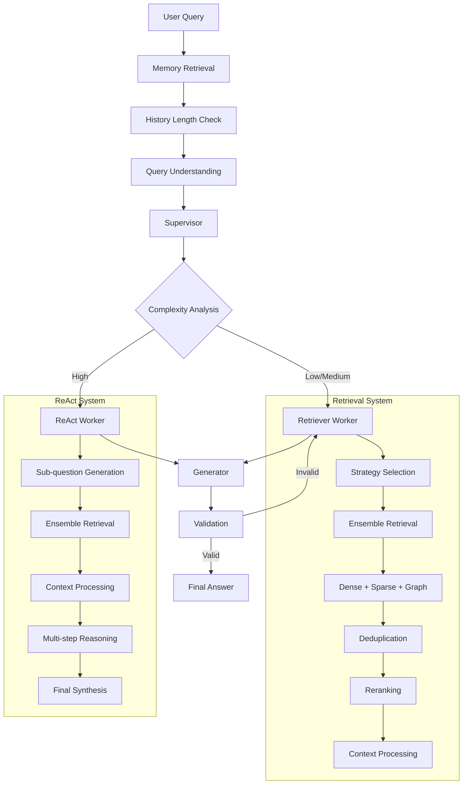

# NEFAC Chatbot - Current System Architecture

## Overview
The NEFAC chatbot implements a sophisticated **Hierarchical Multi-Agent System** using LangGraph for orchestration, with unified retrieval capabilities and advanced query processing. The system combines memory management, intelligent routing, and multiple retrieval strategies to provide comprehensive responses to legal queries.

## System Flow Diagram



## Core Components

### 1. **LangGraph Orchestration** (`server.py`)
- **Entry Point**: Memory retrieval
- **State Management**: Unified `AgentState` flows through all nodes
- **Error Handling**: Comprehensive error routing and recovery
- **Memory Integration**: Persistent conversation memory with MemorySaver

#### Node Sequence:
1. `memory_retrieval` → Retrieves relevant past interactions
2. `check_history_length` → Manages conversation history
3. `query_understanding` → Contextualizes and analyzes query
4. `supervisor` → Routes based on complexity analysis
5. `retriever_worker` OR `react_worker` → Processes query
6. `generator` → Creates final response
7. `validation` → Validates response quality

### 2. **Supervisor Agent** (`complexity_analyzer.py`)
- **Purpose**: Intelligent routing based on query complexity
- **Analysis**: Uses LLM to score complexity (0.0-1.0)
- **Routing Logic**:
  - `< 0.3`: Simple retrieval
  - `0.3-0.7`: Enhanced retrieval  
  - `> 0.7`: Multi-step ReAct reasoning

### 3. **Query Understanding** (`query_understanding.py`)
- **Contextualization**: Converts queries to standalone format
- **Entity Extraction**: Identifies legal entities, organizations, cases
- **Intent Classification**: Determines query type and purpose
- **Graph Integration**: Generates Cypher queries for structured data

### 4. **Unified Retrieval System** (`retrieval_tools.py`)
- **Strategy Selection**: LLM-based + rule-based fallback
- **Ensemble Approach**: Dense + Sparse + Graph retrieval
- **Query Expansion**: Uses graph relationships for entity queries
- **Advanced Processing**: Deduplication, reranking, performance tracking

#### Retrieval Methods:
- **Dense**: Semantic vector search (Qdrant)
- **Sparse**: Keyword search (BM25/Elasticsearch)
- **Graph**: Knowledge graph search (Neo4j)

### 5. **ReAct Multi-Step Reasoning** (`react_worker.py`)
- **Sub-question Generation**: Breaks complex queries into steps
- **Iterative Retrieval**: Uses ensemble retriever for each sub-question
- **Context Synthesis**: Combines information across steps
- **Final Answer**: Comprehensive response with citations

### 6. **Query Translation Strategies** (8 strategies)
All strategies now use the unified ensemble retriever:

1. **Multi-Query**: Generates multiple query perspectives
2. **Decomposition**: Breaks queries into sub-components
3. **RAG Fusion**: Reciprocal rank fusion of multiple queries
4. **HyDE**: Hypothetical document embeddings
5. **Step-Back**: Abstract reasoning with specific follow-up
6. **Factual Strategy**: Optimized for factual queries
7. **Contextual Strategy**: Context-aware query transformation
8. **Basic Strategy**: Fallback approach

### 7. **Context Processing** (`context_processor.py`)
- **Information Extraction**: Structured data from documents
- **Summarization**: Condenses lengthy content
- **Citation Attribution**: Source tracking and attribution
- **Memory Integration**: Stores facts in session memory

### 8. **Generator Agent** (`generator.py`)
- **Response Synthesis**: Creates comprehensive answers
- **Citation Integration**: Includes source references
- **Context Awareness**: Uses extracted info and summaries
- **Quality Control**: Ensures response completeness

### 9. **Validation Agent** (`validation.py`)
- **Quality Assessment**: Validates response against context
- **Completeness Check**: Ensures query is fully answered
- **Feedback Loop**: Routes back for refinement if needed

## State Management

### AgentState Schema
```python
class AgentState(BaseModel):
    # Core conversation
    messages: List[BaseMessage]
    user_query: str
    
    # User management
    user_id: str
    session_id: Optional[str]
    thread_id: Optional[str]
    
    # Routing
    supervisor_decision: Optional[str]
    query_complexity: Optional[float]
    
    # Processing
    contextualized_query: Optional[str]
    memory_summary: Optional[str]
    
    # Retrieval
    retrieval_selection: Optional[Dict]
    retrieved_docs: Optional[str]
    all_retrieved_docs: Optional[List[Any]]
    
    # ReAct
    react_steps: Optional[List[BaseMessage]]
    react_iterations: int
    
    # Output
    final_answer: Optional[str]
    error: Optional[str]
    retry_count: int
```

## Enhanced Features

### 1. **Intelligent Strategy Selection**
- **LLM Analysis**: Uses structured prompts for method selection
- **Pattern Detection**: Recognizes entities, exact terms, concepts
- **Weight Distribution**: Optimizes ensemble weights per query type
- **Fallback Logic**: Graceful degradation when methods fail

### 2. **Advanced Query Processing**
- **Entity Expansion**: Uses graph relationships to expand queries
- **Multi-Query Support**: Handles expanded query variants
- **Performance Tracking**: Millisecond-precision timing
- **Comprehensive Metadata**: Detailed retrieval information

### 3. **Robust Error Handling**
- **Graceful Degradation**: Falls back to working components
- **Error Context**: Rich error information for debugging
- **Recovery Mechanisms**: Automatic retry and fallback strategies
- **Comprehensive Logging**: Detailed operation tracking

### 4. **Memory Integration**
- **Session Memory**: Persistent conversation context
- **Fact Storage**: Automatic fact extraction and storage
- **Memory Retrieval**: Context-aware memory search
- **Cross-Session Learning**: User-specific knowledge accumulation

## Performance Optimizations

### 1. **Caching Strategy**
- **Document Caching**: Reduces redundant retrievals
- **Query Caching**: Stores frequent query results
- **Memory Caching**: Fast access to recent interactions

### 2. **Parallel Processing**
- **Ensemble Retrieval**: Parallel method execution
- **Document Processing**: Concurrent summarization and extraction
- **Multi-Query Handling**: Parallel query processing

### 3. **Resource Management**
- **Connection Pooling**: Efficient database connections
- **Memory Management**: Optimized state handling
- **Token Optimization**: Efficient LLM usage

## Integration Points

### 1. **External Systems**
- **Qdrant**: Vector database for semantic search
- **Elasticsearch**: Full-text search and BM25
- **Neo4j**: Knowledge graph for structured queries
- **Pinecone**: Memory storage and retrieval

### 2. **LLM Integration**
- **OpenAI GPT**: Primary reasoning and generation
- **Cohere Rerank**: Advanced document reranking
- **Structured Output**: Type-safe LLM responses

### 3. **Monitoring & Observability**
- **LangSmith**: Tracing and debugging
- **Performance Metrics**: Execution timing and success rates
- **Error Tracking**: Comprehensive error monitoring

## Configuration

### Environment Variables
```bash
OPENAI_API_KEY=your_key
COHERE_API_KEY=your_key
QDRANT_URL=your_url
ELASTICSEARCH_URL=your_url
NEO4J_URI=your_uri
PINECONE_API_KEY=your_key
LANGCHAIN_TRACING_V2=true
LANGCHAIN_PROJECT=NEFAC_HIERARCHICAL_MULTI_AGENT
```

### Model Configuration
- **Primary LLM**: GPT-4 for complex reasoning
- **Fast LLM**: GPT-3.5-turbo for simple tasks
- **Temperature**: 0 for consistent responses
- **Max Tokens**: Configurable per use case

## Deployment Architecture

### Development
- **Local Setup**: Docker Compose with all services
- **Hot Reload**: FastAPI with auto-reload
- **Debug Mode**: Enhanced logging and tracing

### Production
- **Container Orchestration**: Kubernetes deployment
- **Load Balancing**: Multiple agent instances
- **Database Clustering**: High-availability data stores
- **Monitoring**: Comprehensive observability stack

## Future Enhancements

### 1. **Advanced Reasoning**
- **Chain-of-Thought**: Enhanced reasoning capabilities
- **Tool Integration**: External API and tool usage
- **Multi-Modal**: Support for documents, images, audio

### 2. **Personalization**
- **User Profiles**: Personalized response styles
- **Learning**: Adaptive behavior based on feedback
- **Preferences**: Customizable retrieval strategies

### 3. **Scalability**
- **Distributed Processing**: Multi-node agent execution
- **Caching Layers**: Redis for high-performance caching
- **Auto-Scaling**: Dynamic resource allocation

This architecture provides a robust, scalable, and intelligent system for legal query processing with comprehensive retrieval capabilities and advanced reasoning mechanisms.