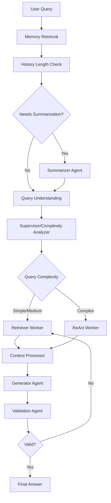

# Backend Architecture Revision - Post Merge Analysis

## Overview
This document provides a comprehensive analysis of the current backend architecture after the successful merge of the hierarchical multi-agent system with memory management and summarization features.

## Current Directory Structure

```
backend/src/
├── app/                           # Application entry points
│   ├── main.py                    # FastAPI application
│   └── server.py                  # Enhanced LangGraph workflow orchestration
├── config/                        # Configuration and constants
│   ├── constant.py                # Model names, API keys, etc.
│   └── prompts.py                 # LLM prompts and templates
├── core/                          # Core agent system
│   └── agents/                    # Multi-agent architecture
│       ├── contextualizer/        # Query understanding and contextualization
│       │   ├── history_manager.py # Chat history management
│       │   └── query_understanding.py # Enhanced query understanding agent
│       ├── supervisor/            # Hierarchical supervision layer
│       │   ├── complexity_analyzer.py # Query complexity analysis
│       │   ├── generator.py       # Enhanced response generation
│       │   ├── strategy.py        # Strategic decision making
│       │   └── validation.py      # Response validation
│       ├── tools/                 # Specialized processing tools
│       │   ├── context_processor.py # Document processing with memory
│       │   ├── document_formatter.py # Document formatting utilities
│       │   ├── memory/            # Memory management system
│       │   │   └── memory.py      # MemoryManager for conversation history
│       │   ├── retrieval/         # Retrieval tools and strategies
│       │   │   ├── graph_retrieval.py # Knowledge graph retrieval
│       │   │   ├── keyword_retrieval.py # Keyword-based search
│       │   │   ├── memory_search.py # Pinecone session memory (NEW)
│       │   │   ├── metadata_filter.py # Metadata filtering
│       │   │   ├── retrieval_tools.py # General retrieval utilities
│       │   │   └── vector_retrieval.py # Vector similarity search
│       │   └── summarizer.py      # Document summarization tools
│       ├── workers/               # Specialized worker agents
│       │   ├── react/             # ReAct reasoning workers
│       │   │   ├── query_translation/ # Query transformation strategies
│       │   │   │   ├── contextual_strategy.py
│       │   │   │   ├── decomposition.py
│       │   │   │   ├── factual_strategy.py
│       │   │   │   ├── hyDe.py
│       │   │   │   ├── multi_query.py
│       │   │   │   ├── rag_fusion.py
│       │   │   │   └── step_back.py
│       │   │   ├── query_transformer.py # Query transformation logic
│       │   │   └── react_worker.py # Multi-step reasoning agent
│       │   └── retriever/         # Document retrieval workers
│       │       ├── retrieval.py   # Core retrieval logic
│       │       └── retriever_worker.py # Retrieval worker implementation
│       └── summarizer.py          # Chat history summarization agent (NEW)
├── exceptions/                    # Custom exception handling
│   └── agent_exceptions.py        # Agent-specific exceptions
├── schemas/                       # Data models and type definitions
│   ├── agent_protocols.py         # Protocol definitions
│   ├── agent_types.py            # Type definitions for agents
│   ├── main.py                   # Main schema exports
│   ├── metadata.py               # Metadata schemas
│   ├── retrieval.py              # Retrieval-related schemas
│   ├── schemas.py                # General schemas
│   ├── state.py                  # Unified state management
│   └── supervisor.py             # Supervisor-related schemas
├── service/                      # External services and utilities
│   ├── crawler/                  # Document crawling service
│   └── ingestion_service/        # Document processing and indexing
└── utils/                        # Utility functions
    └── validation.py             # Validation utilities
```

## Architecture Layers

### 1. Application Layer (`app/`)
- **server.py**: Enhanced orchestration with hierarchical routing and memory integration
- **main.py**: FastAPI application entry point

### 2. Configuration Layer (`config/`)
- **constant.py**: Environment variables, model configurations
- **prompts.py**: LLM prompt templates for different agent types

### 3. Core Agent System (`core/agents/`)

#### 3.1 Contextualizer Layer
- **QueryUnderstandingAgent**: Enhanced query analysis with intent classification
- **HistoryManager**: Manages conversation context and summarization triggers

#### 3.2 Supervisor Layer (Hierarchical Control)
- **ComplexityAnalyzer**: Analyzes query complexity for routing decisions
- **GeneratorAgent**: Enhanced response generation with memory integration
- **ValidationAgent**: Validates responses for accuracy and completeness
- **StrategyAgent**: Strategic decision making for complex queries

#### 3.3 Tools Layer (Specialized Processing)
- **ContextProcessor**: Document processing with Pinecone memory integration
- **MemoryManager**: Conversation history and long-term memory management
- **Retrieval Tools**: Multiple retrieval strategies (vector, keyword, graph, memory)
- **Summarizer**: Document and conversation summarization

#### 3.4 Workers Layer (Execution)
- **ReAct Workers**: Multi-step reasoning with query transformation
- **Retriever Workers**: Document retrieval and processing

### 4. Schema Layer (`schemas/`)
- **AgentState**: Unified state management across all agents
- **Agent Types**: Type-safe definitions for all agent interactions
- **Protocols**: Interface definitions for agent communication

### 5. Service Layer (`service/`)
- **Crawler**: Document ingestion from web sources
- **Ingestion Service**: Document processing and indexing pipeline

## Key Architectural Improvements

### 1. Hierarchical Multi-Agent Design
- **Supervisor-driven routing** based on query complexity
- **Specialized agents** for different types of queries
- **Type-safe communication** between agents

### 2. Memory Integration
- **Session memory** with Pinecone for long-term context
- **Automatic summarization** when conversation history exceeds threshold
- **Memory retrieval** integrated into context processing

### 3. Enhanced State Management
- **Unified AgentState** that flows through all nodes
- **Type safety** with Pydantic models
- **Error handling** and retry mechanisms

### 4. Modular Tool System
- **Pluggable retrieval strategies** (vector, keyword, graph, memory)
- **Context processing pipeline** with memory integration
- **Document summarization** for large contexts

### 5. Advanced Query Processing
- **Multi-step reasoning** for complex queries
- **Query transformation** strategies
- **Intent classification** and entity extraction

## Data Flow Architecture



## Agent Communication Patterns

### 1. Hierarchical Delegation
- Supervisor analyzes and routes to appropriate workers
- Workers report back to supervisor for validation

### 2. Pipeline Processing
- Sequential processing through specialized tools
- Each stage enriches the state for the next

### 3. Memory Integration
- Continuous memory updates throughout the pipeline
- Memory retrieval influences all processing stages

## Performance Considerations

### 1. Lazy Loading
- Agents are initialized only when needed
- Memory retrieval is optimized with top-k selection

### 2. Caching
- LLM responses cached where appropriate
- Document embeddings cached for reuse

### 3. Parallel Processing
- Independent operations can run concurrently
- Memory operations are asynchronous where possible

## Security and Privacy

### 1. User Isolation
- Session-based memory isolation
- User-specific state management

### 2. Data Protection
- Sensitive information filtering
- Secure memory storage with Pinecone

## Future Enhancements

### 1. Agent Specialization
- Domain-specific agents for different query types
- Adaptive learning from user interactions

### 2. Advanced Memory
- Semantic memory clustering
- Temporal memory decay

### 3. Performance Optimization
- Agent response caching
- Predictive pre-loading of relevant context

## Conclusion

The current architecture successfully combines:
- **Hierarchical control** for intelligent routing
- **Memory integration** for contextual awareness
- **Type safety** for reliable operation
- **Modular design** for easy extension

This architecture provides a solid foundation for building sophisticated conversational AI systems with long-term memory and complex reasoning capabilities.