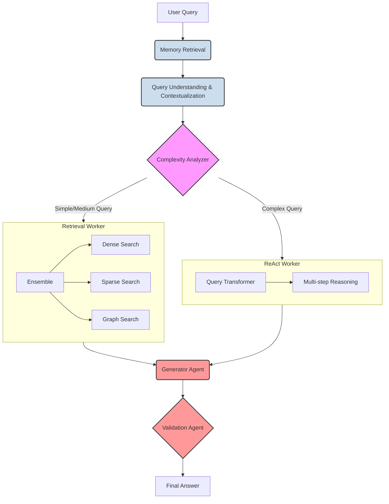

# Current Agent Flow Diagram (Detailed)

This document outlines the current architecture of the multi-agent system as of July 4, 2025. This is a more detailed and accurate representation of the backend implementation than the previous version.

The system is a sophisticated, multi-agent RAG pipeline with conditional routing, ensemble retrieval, and memory.

### Flow Breakdown:

1.  **Memory Retrieval**: The process starts by retrieving relevant memories from the user's past interactions to provide initial context for the query.

2.  **Query Understanding & Contextualization**: The user's query is then processed by the `QueryUnderstandingAgent`. This is a critical pre-processing step that:
    *   **Contextualizes** the query based on the chat history to make it standalone.
    *   Performs **intent classification** (e.g., `document_request`, `general_query`).
    *   Extracts key **entities** from the query.

3.  **Complexity Analyzer**: This agent acts as the primary router. It analyzes the contextualized and enriched query to decide the most appropriate processing path.

4.  **Conditional Routing**:
    *   For **Simple/Medium** queries, the flow is directed to the `Retrieval Worker` for direct-retrieval and answer synthesis.
    *   For **Complex** queries that require more advanced reasoning, the flow is directed to the `ReAct Worker`.

5.  **Worker Execution**:
    *   **`Retrieval Worker`**: This is not a single retriever. It's an **Ensemble Retriever** that intelligently combines results from multiple search strategies to get the most relevant context:
        *   **Dense Search**: For semantic, meaning-based retrieval from a vector database.
        *   **Sparse Search**: For keyword-based retrieval (BM25).
        *   **Graph Search**: For retrieving information about relationships between entities from a knowledge graph.
    *   **`ReAct Worker`**: This worker handles complex queries by breaking them down into smaller, manageable steps:
        *   **Query Transformation**: It uses advanced strategies like RAG-Fusion, Step-Back, or HyDE to rewrite the query for more effective retrieval.
        *   **Multi-step Reasoning**: It can iteratively search for information and reason about it to arrive at a comprehensive answer.

6.  **Generator Agent**: This agent takes the rich context provided by either the `Retrieval Worker` or the `ReAct Worker` and synthesizes a draft answer.

7.  **Validation Agent**: The generated answer is checked against the retrieved source documents to ensure it is factually grounded, accurate, and free of hallucinations.

8.  **Final Answer**: The validated answer is returned to the user.
