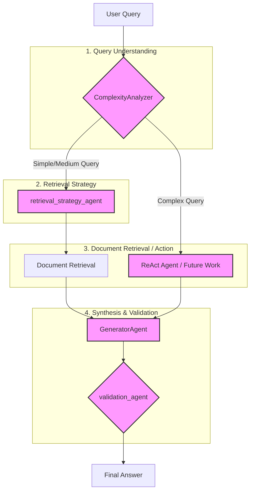

# Current Agent Flow Diagram

This document outlines the current architecture of the multi-agent system as of July 4, 2025. The diagram below illustrates the sequential and conditional flow of a user query through the various processing stages.

The system follows a structured, pipeline-like process rather than a dynamic, delegation-based supervisor model. Each agent is responsible for a specific stage of the RAG pipeline.

### Flow Breakdown:

1.  **User Query**: The process begins with a query from the user.
2.  **`ComplexityAnalyzer`**: This agent acts as the initial router. It analyzes the query's complexity to decide the primary path.
3.  **Conditional Routing**:
    *   For **Simple/Medium** queries, the flow is directed to the standard retrieval pipeline.
    *   For **Complex** queries, the system is designed to route to a `ReAct Agent` for more advanced reasoning, though this path is currently marked as future work.
4.  **`retrieval_strategy_agent`**: Selects the most appropriate method for fetching documents (e.g., vector search, hybrid search).
5.  **Document Retrieval**: Based on the selected strategy, relevant documents are retrieved from the knowledge base.
6.  **`GeneratorAgent`**: This agent takes the retrieved context and the original query to synthesize a draft answer.
7.  **`validation_agent`**: The generated answer is checked against the retrieved documents to ensure it is factually grounded and relevant.
8.  **Final Answer**: The validated (or corrected) answer is returned to the user.
