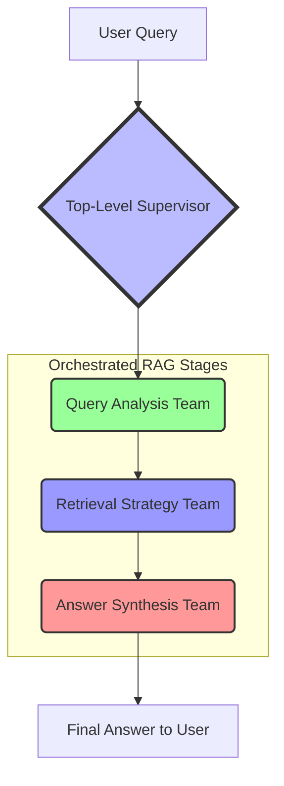

# Proposed Hierarchical Agent Flow

This document outlines a new, more robust architecture for the multi-agent system based on a hierarchical team structure. This design replaces the sequential pipeline with a top-level supervisor that orchestrates specialized sub-teams, each responsible for a distinct stage of the RAG process.

This model provides greater flexibility, scalability, and maintainability.

### Architecture Breakdown

#### 1. Top-Level Supervisor

The **Top-Level Supervisor** is the main entry point and master orchestrator. Its sole responsibility is to manage the overall workflow by delegating tasks to the appropriate sub-team in the correct sequence. It does not perform any domain-specific work itself.

- **Input**: Raw user query.
- **Action**: Hands off the query to the `Query Analysis Team` to begin the process.
- **Orchestration**: After a team completes its work, the supervisor passes the result to the next team in the sequence (`Query Analysis` -> `Retrieval` -> `Synthesis`).

---

#### 2. Query Analysis Team (Sub-Graph)

This team is responsible for understanding, refining, and preparing the user's query for the retrieval stage.

- **Team Supervisor**: Manages the internal workflow of this team.
- **Worker Agents**:
    - **`ComplexityAnalyzer`**: (Your existing agent) Analyzes the query's complexity to determine if special handling is needed.
    - **`QueryReformulator`**: (New agent) Rewrites the user's query to be more optimal for retrieval. This could involve generating multiple variations of the query, adding context, or extracting keywords.
- **Output**: A refined, optimized query (or set of queries) ready for retrieval.

---

#### 3. Retrieval Strategy Team (Sub-Graph)

This team is responsible for fetching the most relevant information from all available data sources.

- **Team Supervisor**: Manages the various retrieval agents and decides which ones to use based on the refined query.
- **Worker Agents**:
    - **`VectorSearchAgent`**: Performs semantic search on your vector database.
    - **`GraphSearchAgent`**: (Future work) Traverses a knowledge graph to find related entities and documents.
    - **`BM25SearchAgent`**: (Future work) Performs lexical (keyword) search.
    - **`ResultFusionAgent`**: Merges and re-ranks the results from the various search agents to create a single, high-quality context.
- **Output**: A comprehensive and relevant context to be used for answer generation.

---

#### 4. Answer Synthesis Team (Sub-Graph)

This team is responsible for generating a final, validated answer for the user.

- **Team Supervisor**: Manages the generation and validation process.
- **Worker Agents**:
    - **`GeneratorAgent`**: (Your existing agent) Synthesizes an answer based on the retrieved context.
    - **`ValidationAgent`**: (Your existing agent) Validates the generated answer against the source documents to ensure accuracy and prevent hallucination.
- **Output**: The final, validated answer that is sent to the user.

### Benefits of this Approach

- **Scalability**: New retrieval methods or analysis steps can be added as new agents within a team without disrupting the overall flow.
- **Maintainability**: Each team is self-contained, making it easier to debug and improve specific parts of the RAG process.
- **Flexibility**: The supervisors within each team can make complex decisions about which worker agents to use, allowing for more dynamic and intelligent processing.
- **Clear Separation of Concerns**: Each agent and team has a single, well-defined responsibility.
