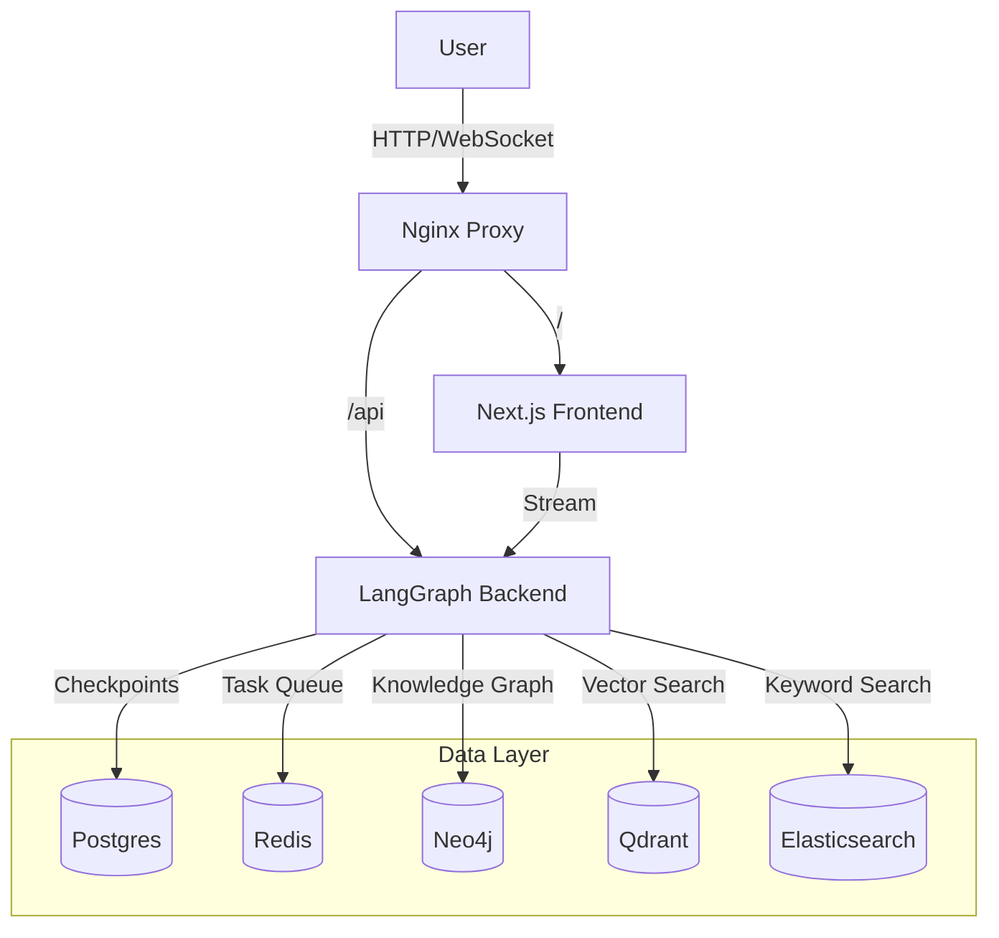

# NEFAC System Design Document

## 1. Architecture Overview

The NEFAC Chatbot is a **Multi-Agent RAG (Retrieval-Augmented Generation) System** designed to assist with public records requests and open meeting laws in New England.

### High-Level Diagram

## 2. Component Design

### 2.1 Frontend (`/client`)
*   **Framework**: Next.js 14+ (App Router).
*   **Styling**: Tailwind CSS + Shadcn UI.
*   **State Management**: `nuqs` (URL-based state for `threadId`), React Context (`StreamProvider`, `ThreadProvider`).
*   **Communication**: Server-Sent Events (SSE) via `langchain/langgraph-sdk` for streaming agent responses.

### 2.2 Backend (`/backend`)
*   **Framework**: LangGraph (built on LangChain).
*   **Runtime**: `langgraph-api` (Asynchronous, event-driven).
*   **Graph Definition** (`src/app/server.py`):
    *   **Graph Name**: `deep_researcher`
    *   **Nodes**:
        *   `clarify_with_user`: Determines if user intent is clear.
        *   `write_research_brief`: Generates a plan.
        *   `research_supervisor`: Manages the research loop.
        *   `final_report_generation`: Synthesizes findings.
        *   `memory_summarizer`: Summarizes conversation history.
        *   `quick_agent`: Fast path for simple queries.
        *   `cleanup_node`: Resets state at the end of a turn.
    *   **Edges**: Conditional routing based on `research_mode` ("quick" vs "deep").

### 2.3 Ingestion & Crawler (`/backend/src/service`)
*   **Crawler** (`src/service/crawler/run.py`):
    *   **Modes**: `full`, `wordpress`, `youtube`, `sync-only`.
    *   **Features**: Incremental crawling, rigid validation, parallel downloading.
    *   **Output**: Raw files in `nefac_documents/`.
*   **Ingestion Service** (`src/service/ingestion_service/processing.py`):
    *   **Entry Point**: `process_all_file_types`
    *   **Workflow**:
        1.  **Load**: Reads metadata from `metadata/{file_type}_metadata.json`.
        2.  **Ingest**: Calls `run_ingestion_workflow` (async).
        3.  **Store**:
            *   **Qdrant**: Dense vectors (enabled via `--qdrant-only` or default).
            *   **Elasticsearch**: Keyword search (enabled via `--es-only` or default).
            *   **Neo4j**: Graph RAG (enabled via `--graph-rag-only` or default).
    *   **Advanced Features**: Semantic linking, community detection, topic extraction.

## 3. Infrastructure & Deployment

*   **Containerization**: Docker & Docker Compose.
*   **Base Image**: **Wolfi** (Chainguard) for security and minimal footprint.
*   **Networking**: Internal Docker network `nefacnet`.
*   **Security**:
    *   CORS configured for frontend access.
    *   Environment variables managed via `.env`.

## 4. Data Flow

1.  **User Input**: User types a message in the Frontend.
2.  **Streaming**: Message sent to Backend via `POST /threads/{id}/runs/stream`.
3.  **Agent Execution**:
    *   LangGraph runtime executes the graph.
    *   State is checkpointed to **Postgres** at every step.
    *   Background tasks are queued in **Redis**.
4.  **Retrieval (if needed)**:
    *   Agent queries **Qdrant** (semantic) and **Elasticsearch** (keyword).
    *   Results are re-ranked and synthesized.
5.  **Response**: Token-by-token stream sent back to Frontend.
